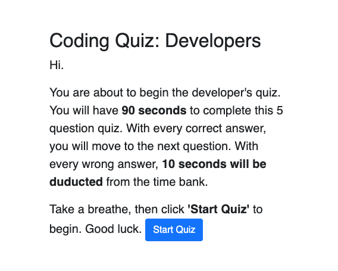

# Coding Quiz
As I proceed in my career as a web developer, I will be asked to complete some kind of coding assessment, which is typically a combination of multiple-choice questions and interactive challenges. I built a timed code quiz with multiple-choice questions. This app runs in the browser and features dynamically updated HTML and CSS powered by JavaScript code. It also features a clean and polished user interface and is responsive, ensuring that it adapts to multiple screen sizes.
<p>
<a href="https://markmcdnyu.github.io/Coding-Quiz/" target="_blank">Coding Quiz</a>
</p>

## User Story
```
AS a coding  student
I WANT to take a timed quiz on JavaScript fundamentals that stores high scores
SO THAT I can gauge my progress compared to my peers
```

## Acceptance Criteria
```
GIVEN I am taking a code quiz
WHEN I click the start button
THEN a timer starts and I am presented with a question
WHEN I answer a question
THEN I am presented with another question
WHEN I answer a question incorrectly
THEN time is subtracted from the clock
WHEN all questions are answered or the timer reaches 0
THEN the game is over
WHEN the game is over
THEN I can save my initials and score
```
The following picture shows the home page of the application:


### Review
You are required to submit the following for review:
* The URL of the functional, deployed application.
* The URL of the GitHub repository. Give the repository a unique name and include a README describing the project.
- - -
© 2019 Trilogy Education Services, a 2U, Inc. brand. All Rights Reserved.